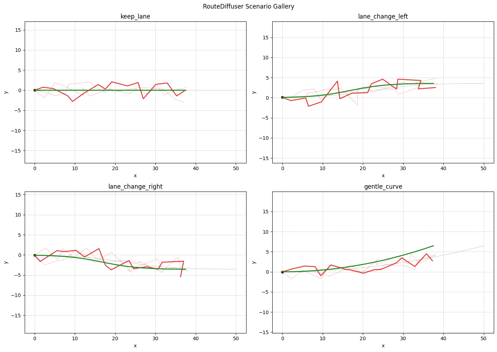

# RouteDiffuser

> 基于路线条件约束的自动驾驶轨迹规划扩散模型项目。

`RouteDiffuser` 是一个面向公开展示和简历项目的自动驾驶规划核心仓库。它不依赖私有日志、内部仿真服务或公司部署链路，而是把规划系统里最能体现工程能力的部分整理成可运行、可复现、可解释的代码：场景建模、路线条件扩散生成、多候选轨迹选择、评估报告、可视化和轻量闭环 rollout。




## 项目亮点

### 数据与接口

- 统一的 canonical scene schema，覆盖 ego、邻车、车道线、route polyline、mask 和未来轨迹。
- manifest 驱动的数据准备流程，训练、评估和 demo 不再依赖脚本里的临时切样本。
- 支持 synthetic 数据和公开 NPZ bridge format，便于后续接入真实公开数据。
- 提供数据统计缓存，方便做归一化、数据检查和实验复现。

### 规划模型

- 实现 route-conditioned diffusion planner，核心解码器是条件 1D U-Net。
- 使用 route prior residual diffusion，让模型预测围绕路线先验的残差轨迹。
- 支持多分辨率 pyramid diffusion noise。
- 支持 learned trajectory scorer head 和 heuristic/learned hybrid selection。
- 支持多种 scorer candidate strategy：`gt_prior_noise`、`gt_prior_drift`、`mixed`、`route_anchor`。
- 支持 `concat_mlp` 和 `token_attention` 两类 scene fusion ablation。

### 安全与评估

- 评估报告包含 overall、candidate-set、scenario-level 指标。
- 支持 ADE/FDE、route error、progress、comfort proxy、clearance、collision rate 等指标。
- 新增 oriented-box collision，用车辆矩形 footprint 检查碰撞，而不是只看点距离阈值。
- scorer 诊断指标包含 heuristic regret、learned preference regret、selected-candidate agreement。
- 支持 failure analysis、ablation matrix 和 experiment registry。

### 部署与运行

- 支持 ONNX denoiser core 导出。
- 支持 ONNX / PyTorch parity check。
- 支持 CPU/GPU inference benchmark。
- 支持轻量 closed-loop rollout，并输出 trace、summary 和 plot。

## 快速开始

```bash
pip install -e .[dev]
python scripts/prepare_dataset.py --output outputs/manifests/route_diffuser_synthetic_train.json
python scripts/demo_planner.py
```

安装后也可以使用命令别名：

- `route-diffuser-prepare`
- `route-diffuser-stats`
- `route-diffuser-export-npz`
- `route-diffuser-export-onnx`
- `route-diffuser-check-onnx`
- `route-diffuser-benchmark`
- `route-diffuser-rollout`
- `route-diffuser-compare-scorer`
- `route-diffuser-ablations`
- `route-diffuser-failures`
- `route-diffuser-registry`
- `route-diffuser-train`
- `route-diffuser-infer`
- `route-diffuser-eval`
- `route-diffuser-demo`

## 常用文档

- 命令手册：[docs/commands.md](docs/commands.md)
- 产物说明：[docs/artifacts.md](docs/artifacts.md)
- 架构说明：[docs/architecture.md](docs/architecture.md)
- 消融实验：[docs/ablations.md](docs/ablations.md)
- 发布检查清单：[docs/release_checklist.md](docs/release_checklist.md)
- 简历项目案例说明：[docs/portfolio_case_study.md](docs/portfolio_case_study.md)
- 项目路线图：[ROADMAP.md](ROADMAP.md)

## Demo 产物

`python scripts/demo_planner.py` 会在 `outputs/portfolio_demo/` 下生成一套适合放在 GitHub 首页或简历项目页里的展示产物：

- `prediction_plot.png`
- `candidate_trajectories.png`
- `scenario_gallery.png`
- `evaluation_report.json`
- `evaluation_report.md`
- `portfolio_summary.json`
- `portfolio_summary.md`
- `demo_checkpoint.pt`
- `predictions.pt`

## 架构概览

```text
structured scenario generator / public dataset adapter
  -> canonical scene tensors
  -> scene encoder
  -> route prior
  -> conditional 1D U-Net diffusion decoder
  -> iterative denoising sampler
  -> candidate trajectory bundle
  -> heuristic / learned hybrid scoring
  -> reports, plots, rollout, registry
```

## 目录结构

- `planner/datasets/`：场景 schema、synthetic 数据集、数据工厂和统计缓存。
- `planner/datasets/adapters/`：可插拔数据适配器，包含 synthetic 和 NPZ bridge。
- `planner/models/`：scene encoder、diffusion planner、diffusion decoder、trajectory scorer。
- `planner/diffusion/`：噪声采样、schedule 和 DDPM 工具。
- `planner/inference/`：首帧锚定、候选轨迹打分和选择。
- `planner/metrics/`：轨迹指标、comfort 指标、oriented-box collision。
- `planner/trainers/`：训练和评估循环。
- `planner/reports/`：结构化评估报告、失败分析和实验 registry。
- `planner/export/`：ONNX 导出、parity 和 benchmark。
- `planner/rollout/`：轻量闭环 rollout。
- `planner/visualization/`：轨迹图、候选轨迹图、场景画廊。
- `scripts/`：公开 CLI 包装脚本。
- `configs/`：数据、模型、训练和推理配置。
- `docs/`：命令、架构、产物、消融、发布和简历案例说明。

## 适合简历怎么写

- 使用 PyTorch 实现一个 route-conditioned autonomous driving trajectory planner，核心为条件扩散模型和 1D U-Net 去噪解码器。
- 设计 canonical planner scene schema，统一 ego、neighbors、lanes、route polylines、masks 和 future trajectory target。
- 实现 route-prior residual diffusion、multi-sample candidate generation、hybrid heuristic/learned scoring 和 route-anchor candidate supervision。
- 构建规划评估体系，覆盖 ADE/FDE、route consistency、comfort proxy、oriented-box collision、candidate oracle metrics、scenario breakdown 和 failure analysis。
- 完成数据 manifest、NPZ bridge、ONNX export/parity、benchmark、closed-loop rollout、ablation matrix 和 portfolio artifacts。

## 项目边界

这个仓库有意保持 planner-first：

- 已包含：场景建模、扩散规划、synthetic 数据、NPZ bridge、候选评分、评估报告、闭环 rollout、可视化和作品集产物。
- 暂不包含：私有数据适配器、私有仿真服务、内部部署插件、生产级 RL fine-tuning 链路。

这种边界能让项目在公开环境里保持完整、可运行、可解释，而不是依赖无法共享的基础设施。
