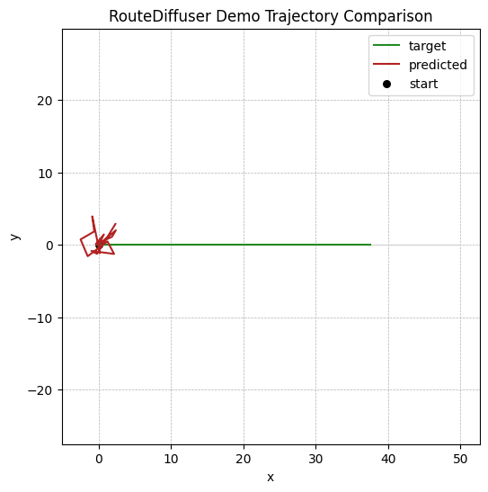

# RouteDiffuser

> Autonomous driving trajectory planning with a route-conditioned diffusion policy.

`RouteDiffuser` is the public-facing project name for the `nn_planner` codebase. The goal is to
show the planner core of an autonomous driving system in a form that reads well on GitHub and in a
resume: scene representation, conditional trajectory generation, evaluation, and visual artifacts.



## Why This Repo Exists

Most autonomous driving projects cannot ship their real datasets, simulator stacks, or internal
evaluation infrastructure. This repository focuses on the part that can be shown clearly:

- canonical scene-schema design for ego, neighbors, lanes, route polylines, and masks
- a conditional 1D U-Net diffusion policy for future ego trajectory generation
- structured synthetic driving scenes that still look like real planning tasks
- open-loop metrics, checkpointing, and plotting for inspection and storytelling

## What It Demonstrates

- Built a route-conditioned planner that denoises future trajectories from scene context.
- Implemented DDPM-style training, iterative inference, and first-step anchoring to the current ego state.
- Modeled keep-lane, lane-change-left, lane-change-right, and curved-road scenarios in a reusable synthetic generator.
- Packaged the project with training, inference, evaluation, and portfolio demo scripts.

## Quick Start

```bash
pip install -e .[dev]
python scripts/demo_portfolio.py
```

That command produces a compact project showcase in `outputs/portfolio_demo/`:

- `prediction_plot.png`
- `portfolio_summary.json`
- `portfolio_summary.md`
- `demo_checkpoint.pt`
- `predictions.pt`

## Demo Outputs

The portfolio demo trains a small planner, samples future trajectories, evaluates open-loop metrics,
and writes a summary that is easy to reuse in a GitHub project page or resume portfolio.

- Main demo script: [`scripts/demo_portfolio.py`](scripts/demo_portfolio.py)
- Generated summary: [`outputs/portfolio_demo/portfolio_summary.md`](outputs/portfolio_demo/portfolio_summary.md)
- Generated JSON: [`outputs/portfolio_demo/portfolio_summary.json`](outputs/portfolio_demo/portfolio_summary.json)

## Architecture

```text
structured scenario generator / future dataset adapter
  -> canonical scene tensors
  -> scene encoder
  -> conditional diffusion decoder (1D U-Net)
  -> iterative trajectory denoising
  -> open-loop metrics and debugging plots
```

## Repository Tour

- `planner/datasets/`: canonical scene schema and structured synthetic scenarios
- `planner/models/`: scene encoder and conditional diffusion decoder
- `planner/diffusion/`: noise schedule and reverse diffusion utilities
- `planner/trainers/`: training and evaluation loops
- `planner/visualization/`: trajectory plotting utilities
- `scripts/`: train, infer, evaluate, and portfolio demo entry points

## Resume-Friendly Project Framing

- Autonomous driving planner focused on route-conditioned future trajectory generation.
- Conditional diffusion model with a 1D U-Net decoder implemented in PyTorch.
- Canonical scene interfaces, synthetic scenario generation, open-loop metrics, and visualization included.

## Scope

This repo is intentionally planner-first.

- included: scene modeling, diffusion planning, synthetic scenario generation, evaluation, visualization, portfolio artifacts
- deferred: proprietary dataset adapters, simulator integration, reward modeling, RL fine-tuning

That tradeoff makes the codebase strong as a public project: it shows system design and modeling
ability without depending on private infrastructure.
